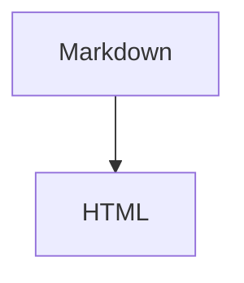
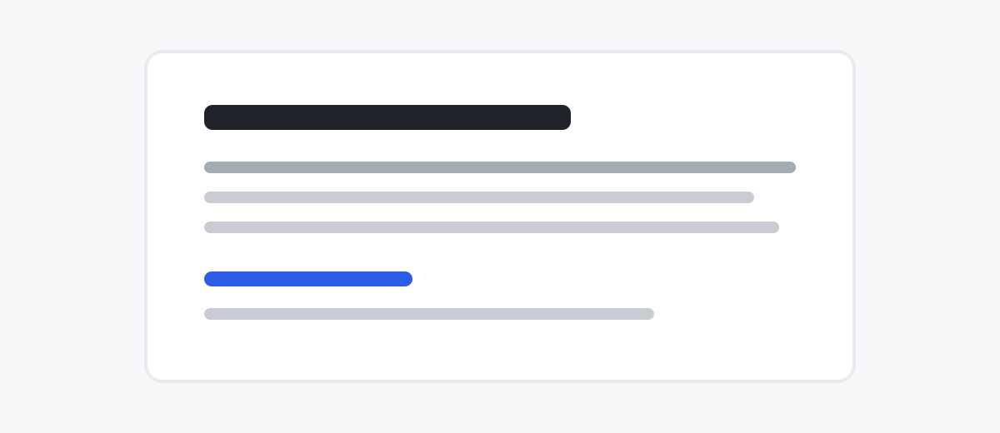

# 阅读视图验收样稿

这是一段保持原样的导语，包含 emoji ✨、英文 Markdown 和作者故意留下的错别字：清淅。

## 标题层级

二级标题建立主要章节，下面继续检查更深的层级。

### 三级标题

三级标题保持紧凑而清楚。

#### 四级标题按三级标题样式呈现

标题文字和语义层级仍然保留。

## 引用与警示块

> [!CAUTION]
> 删除产物前，确认 Markdown 源文件仍然存在。

> [!WARNING]
> HTML 是可再生的阅读产物，不是新的事实源。

> [!NOTE]
> 主题样式被内联进单文件 HTML。

> [!IMPORTANT]
> 文本等价校验在每次渲染时强制执行。

> [!TIP]
> 直接在浏览器中打开生成的 HTML 即可阅读。

> 普通引用保持安静，不抢正文的注意力。

## 列表映射

### 状态清单

- ✅ 文本等价校验已启用
- ⚠️ 相对图片路径仍需随文件一起提供
- 🔴 原始 Markdown 不可被覆盖
- ❌ 禁止手工修补 HTML 正文

### 定义式条目

- **输入**:已有的 UTF-8 Markdown 文件
- **输出**： 同目录下同名的单文件 HTML
- **依赖**: `markdown-it-py`

### 普通清单

- 普通列表保留标准项目符号
- 混合内容不会获得额外语义样式

### 任务清单

- [x] 已完成的任务使用静态勾选框
- [ ] 未完成的任务保持清楚可辨
- 普通同级条目仍保留普通列表语义

### 混合 glyph 反例

- ✅ 这一项看起来像状态
- 这一项没有状态 glyph，因此整个列表必须保持普通样式

### 部分定义式反例

- **负责人**:林舟
- 截止时间:周五

## 行内元素

已知文件 `scripts/render.py`、`README.md` 和未知扩展名路径 `/var/cache/archive.bin` 使用文件胶囊；`archive.bin` 与 `render` 使用普通行内 code。这里还有一个[项目链接](https://example.com)、裸链接 https://example.com/docs、**粗体内容**、*斜体内容*和~~删除内容~~。

[跳转到数学公式](#数学公式)用于检查确定性标题锚点。

---

## 数学公式

行内公式 $E = mc^2$ 与 $a^2 + b^2 = c^2$ 跟随正文基线排版。

括号定界的行内公式 \(e^{i\pi} + 1 = 0\) 使用同一排版系统。

$$
x = \frac{-b \pm \sqrt{b^2 - 4ac}}{2a}
$$

$$
\operatorname{softmax}(z_i) = \frac{e^{z_i}}{\sum_{j=1}^{K} e^{z_j}}
$$

\[
\int_0^1 x^2\,dx = \frac{1}{3}
\]

## 表格

| 项目 | 数量 | 完成率 | 预算 | 备注 |
| --- | ---: | ---: | ---: | --- |
| 解析 | 12 | 95% | ¥1,200 | 稳定 |
| 渲染 | 8 | 100% | ¥800 | 稳定 |
| 校验 | 3 | 100% | ¥300 | 强制 |

## 术语定义

唯一事实源
: Markdown 文件是唯一允许编辑的内容载体。

阅读产物
: HTML 可以随时删除并从 Markdown 重新生成。

## 代码块

```python
def render(source: str, retries: int = 2) -> str:
    message = "visible text stays unchanged"
    return source if retries >= 0 else message
```



## 图片与图注




状态  保持在当前文字流中，不再扩张成整页图片。

## 安全 HTML 子集

<details open>
<summary>可展开的补充说明</summary>

按下 <kbd>Ctrl</kbd> 与 <kbd>K</kbd>，查看被 <mark>明确标记</mark> 的第 2<sup>项</sup> 内容。<br>换行仍然是静态 HTML。

</details>

<!-- 这是不会出现在阅读正文中的作者注释。 -->

脚注引用使用确定性编号并保持正文来源不变。[^audit]

[^audit]: 脚注正文仍然来自 Markdown，不由渲染器补写。

最后一段仍然只是作者写下的最后一段。
